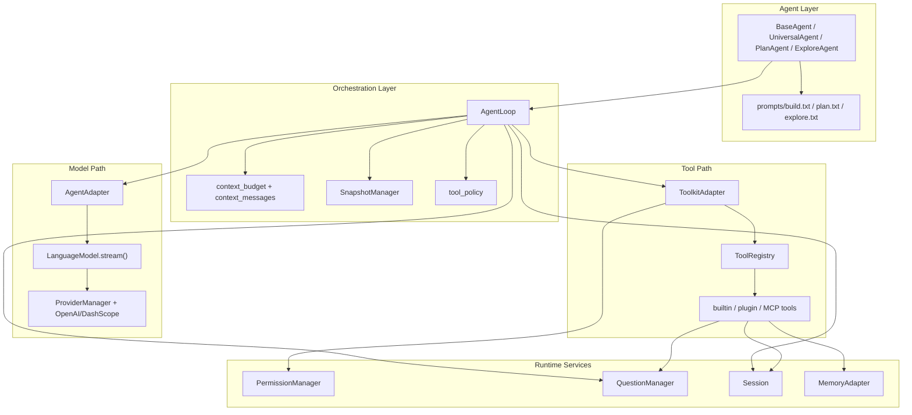
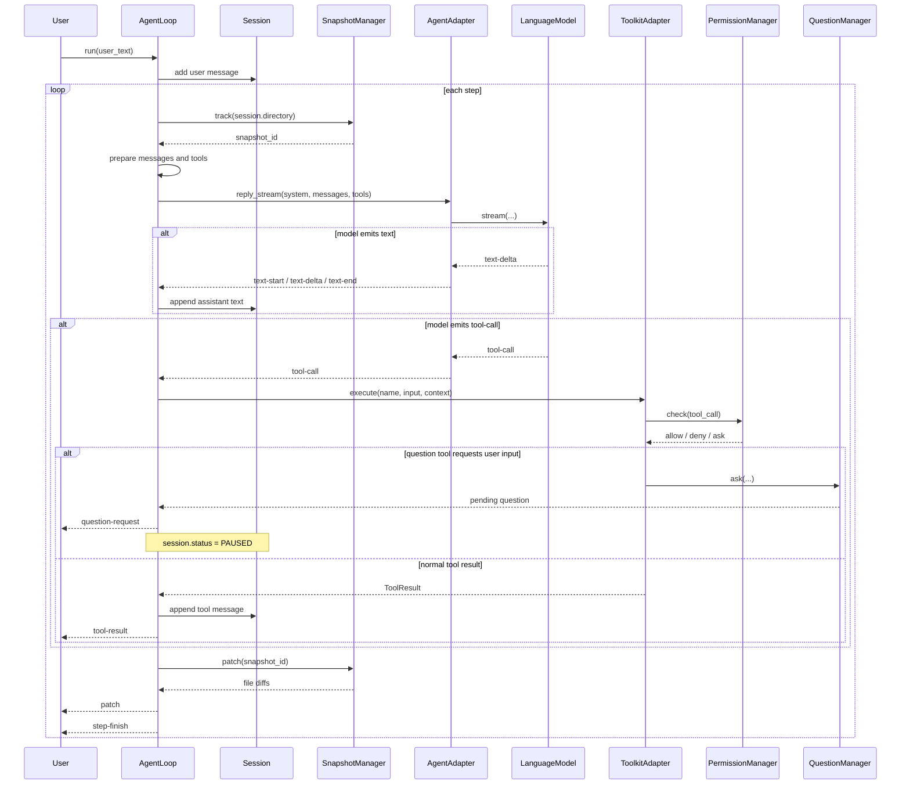

# OpenAgent Core 架构分析（代码对齐版）

> 文档范围：`openagent/src/openagent/`
> 
> 本文档以当前 Python 实现为准，优先描述“已经落地的运行时架构”，并把“预留接口 / 尚未完成的能力”单独标注，避免把设计目标和现状混写。

---

## 1. 一句话总结

当前的 OpenAgent 是一个以 `AgentLoop` 为中心的 Python 智能体运行时：

- 上层用 `UniversalAgent / PlanAgent / ExploreAgent` 封装不同角色和默认提示词。
- 中间层由 `AgentAdapter + AgentLoop` 把模型流式输出、工具调用、权限检查、上下文预算、问题澄清和补丁追踪串起来。
- 下层通过 `LanguageModel` 协议对接不同 Provider，通过 `ToolkitAdapter` 对接内置工具、插件工具和远程 MCP 工具。

从代码结构看，它已经不是一个只有基础骨架的原型，而是一个具备以下能力的运行时内核：

- 流式文本 + 工具调用
- 工具权限控制
- 会话状态与 todo 管理
- 上下文预算、工具输出裁剪与上下文压缩
- 用户澄清问题的暂停/恢复机制
- 文件快照与 patch diff 生成
- OpenAI 兼容 Provider 与 DashScope 兼容 Provider
- 远程 MCP 工具桥接

---

## 2. 总体分层

```text
┌───────────────────────────────────────────────────────────────┐
│ Agent Layer                                                  │
│ BaseAgent / UniversalAgent / PlanAgent / ExploreAgent        │
│ prompts/build.txt / plan.txt / explore.txt                   │
└──────────────────────────────┬────────────────────────────────┘
                               │
┌──────────────────────────────▼────────────────────────────────┐
│ Orchestration Layer                                           │
│ AgentLoop                                                     │
│ - step control / retry / doom-loop guard                      │
│ - context budget / compaction / overflow fallback             │
│ - runtime datetime injection                                  │
│ - tool-policy guard (research/current/plan)                   │
│ - snapshot diff / question pause-resume                       │
└───────────────┬───────────────────────┬───────────────────────┘
                │                       │
┌───────────────▼──────────────┐ ┌──────▼────────────────────────┐
│ Model Adapter Path           │ │ Tool Execution Path           │
│ AgentAdapter                 │ │ ToolkitAdapter                │
│ LanguageModel.stream()       │ │ ToolRegistry + middleware     │
│ StreamEvent normalization    │ │ builtin / plugin / MCP tools  │
└───────────────┬──────────────┘ └──────┬────────────────────────┘
                │                       │
┌───────────────▼──────────────┐ ┌──────▼────────────────────────┐
│ Provider Layer               │ │ Runtime Services              │
│ ProviderManager              │ │ PermissionManager             │
│ OpenAI / DashScope           │ │ QuestionManager               │
│ Anthropic/Gemini/Ollama stub │ │ Session / MemoryAdapter       │
└──────────────────────────────┘ └───────────────────────────────┘
```

一个更贴近运行时的依赖方向如下：

```text
BaseAgent
  -> resolve_system_prompt()
  -> AgentAdapter
      -> LanguageModel.stream()
  -> AgentLoop
      -> PermissionManager
      -> ToolkitAdapter
          -> ToolRegistry
          -> builtin tools / plugin tools / MCP bridge
      -> QuestionManager
      -> SnapshotManager
      -> Session
      -> context_budget / context_messages / tool_policy
```

如果你希望在支持 Mermaid 的文档站、知识库或 Web UI 中直接展示结构图，可以用下面这张模块图：



---

## 3. 主执行链路

`AgentLoop.run(user_text)` 是当前系统真正的执行中枢。

### 3.1 启动阶段

1. 根据 `agent.config.permission` 设置权限规则集。
2. 将用户输入追加到 `Session.messages`。
3. 如果 Agent 使用的是默认系统提示词，则对首轮用户请求做 `tool_policy` 分类：
   - research / current：优先要求 `web_search`
   - plan：优先要求 `todoread` / `todowrite`
4. 初始化本轮状态：步数、失败跟进消息、工具列表等。

### 3.2 每一步循环都会做什么

1. `SnapshotManager.track()` 对工作目录建快照。
2. 根据 Agent 的 `tools` 配置过滤可用工具。
3. 调用 `_prepare_messages_for_model()`：
   - 注入 runtime datetime 提示
   - 检查 context budget
   - 必要时裁剪旧工具输出
   - 必要时生成上下文压缩摘要
   - 仍然超长时走 overflow trim / text-only final attempt
4. 通过 `AgentAdapter.reply_stream()` 调模型。
5. 接收并转发模型事件：
   - `text-*`
   - `tool-call`
   - 首步若启用 `tool_policy`，会先缓冲事件，确认工具使用符合策略后再放行
6. 将本步 assistant 文本和 tool call 元数据写回 `Session.messages`。
7. 依次执行工具调用：
   - 走 `ToolkitAdapter.execute()`
   - 中间经过权限中间件和日志中间件
   - 若工具内部发起 `question` 请求，Loop 会发出 `question-request` 事件，并把 `Session.status` 切到 `PAUSED`
8. 将 `ToolResult` 投影成精简后的 `tool` 消息写回会话；必要时把完整输出落盘到 `.openagent/tool_output/<call_id>.txt`。
9. 计算快照前后 diff，并发出 `patch` 事件。
10. 发出 `step-finish` 事件；如果本步产生了工具调用，则继续下一步，否则结束。

对应的一次典型请求时序，可以用下面这张 Mermaid 时序图来理解：



### 3.3 实际流事件类型

当前实现里的 `StreamEvent` 比旧文档更完整，包含：

| 事件 | 说明 |
|------|------|
| `text-start` | 本段文本开始 |
| `text-delta` | 文本增量 |
| `text-end` | 本段文本结束 |
| `tool-call` | 模型请求调用工具 |
| `tool-result` | 工具执行结果 |
| `question-request` | 工具需要 UI/宿主向用户发起结构化提问 |
| `step-start` | 单步开始，附 `snapshot_id` |
| `step-finish` | 单步结束，附 token/cost/finish_reason |
| `patch` | 本步造成的文件 diff |
| `error` | 运行中断或失败 |

---

## 4. Agent 层

### 4.1 角色模型

当前 Agent 类型很薄，主要负责三件事：

- 持有 `AgentConfig`
- 绑定一个 `LanguageModel`
- 解析系统提示词

实际类如下：

- `BaseAgent`
- `UniversalAgent`
- `PlanAgent`
- `ExploreAgent`

它们的核心差异不是不同的执行器，而是默认 prompt 文件不同：

| Agent | 默认提示词 | 典型用途 |
|------|------------|----------|
| `UniversalAgent` | `prompts/build.txt` | 编码、改文件、调试 |
| `PlanAgent` | `prompts/plan.txt` | 分析、规划、架构设计 |
| `ExploreAgent` | `prompts/explore.txt` | 只读探索、快速扫代码 |

### 4.2 Prompt 解析规则

`resolve_system_prompt()` 的优先级是：

1. 显式传入的 `system_prompt`
2. `default_prompt_name` 对应的内置 prompt
3. `config.prompt` 追加到默认 prompt 后面

这意味着：

- Agent 的角色差异主要来自 prompt，而不是不同的 Loop 实现。
- `tool_policy` 的首轮策略守卫，只有在使用默认系统 prompt 时才会开启；如果业务侧覆盖了系统提示词，这层守卫默认不生效。

---

## 5. Loop / 控制层

这是当前架构里最“重”的部分，也是 OpenAgent 的真正核心。

### 5.1 `AgentLoop` 的职责

`AgentLoop` 不只是“while loop”，而是把以下横切能力集中在一起：

- 步数控制
- 首轮工具策略守卫
- 上下文预算检查
- 历史工具输出裁剪
- 上下文压缩摘要
- overflow 降级策略
- runtime 时间注入
- 工具调用执行与错误归一化
- 结构化提问的暂停/恢复
- 文件快照与 patch 输出
- doom-loop 检测

### 5.2 Context Budget 子系统

这一块是当前实现比旧文档更成熟的地方。

`context_budget.py + context_messages.py + message_materializer.py` 共同完成：

- 估算模型输入 token
- 识别工具消息占用
- 裁剪旧工具结果
- 生成上下文压缩摘要
- 在极限情况下退化到 text-only final attempt

支持的策略是：

- `auto`：先 prune，再 compact，再 overflow trim
- `compact`：允许压缩，但不做 overflow trim
- `error`：直接报错

实际补救顺序是：

```text
initial check
  -> prune old tool outputs
  -> compact context summary
  -> overflow trim recent turns
  -> final text-only attempt (可关闭工具)
  -> still overflow => error
```

### 5.3 Runtime Context 注入

每次模型调用前都会注入一条 synthetic assistant message，内容包含当前本地时间和时区，用来约束模型正确解释“今天/明天/本周”这类相对时间。

### 5.4 Doom Loop 检测

`DoomLoopDetector` 会记录最近 N 次工具调用；当连续多次调用完全相同的工具名和参数时，Loop 直接报错终止，防止智能体卡在重复工具调用里。

### 5.5 Retry 现状

- `core/loop/retry.py` 中存在 `RetryManager` 工具类。
- 但当前 `AgentLoop` 实际上没有注入这个对象，而是在 `run()` 内部手写了一段指数退避重试逻辑。

也就是说：`RetryManager` 目前更像保留的公共组件，而不是 Loop 的真实依赖。

### 5.6 Snapshot / Patch

`SnapshotManager` 会在每一步前扫描 `session.directory`，并在步骤结束后对比文件哈希和文本内容，生成统一 diff。

这层能力带来两个好处：

- 宿主可以流式拿到本步变更列表
- 文本 diff 可以和工具结果一起作为 UI 或日志事件输出

当前它是“有界扫描”：

- 超大文件会跳过
- 文本 diff 只在可解码、且大小未超过阈值时生成

---

## 6. Tool 层

### 6.1 整体设计

工具系统由四个核心部件组成：

- `ToolDefinition`：工具元信息和执行函数
- `ToolRegistry`：工具注册表
- `ToolkitAdapter`：工具暴露与执行入口
- `Middleware`：工具调用横切逻辑

设计方向很明确：

- 用 dataclass 定义参数类型
- 自动生成 OpenAI-compatible JSON Schema
- 工具实现返回结构化 `ToolOutput`
- Loop 层再把 `ToolOutput` 转成对话里的 `ToolResult` / `tool` message

### 6.2 当前内置工具

内置工具按“插件模块”组织，统一从 `core/tool/builtin/__init__.py` 注册。

当前已经内置：

| 类别 | 工具 |
|------|------|
| 文件 | `read`, `write`, `edit`, `glob`, `grep`, `ls` |
| Shell | `bash` |
| 搜索 | `code_search` |
| Web | `web_fetch`, `web_search` |
| 记忆 | `memory_read`, `memory_write` |
| Todo | `todoread`, `todowrite` |
| 提问 | `question` |
| 远程 MCP | 动态注册，名称由 server/tool 推导 |

### 6.3 关键行为与安全约束

当前工具层里有几条很重要的运行时约束：

1. 文件工具只允许在 `session_root` 内解析路径。
2. 对已存在文件执行 `write`/`edit` 前，要求该文件先被 `read` 过。
3. `grep` 优先调用 `rg`，找不到时回退到 Python 正则扫描。
4. `bash` 的 `workdir` 必须落在 `session_root` 内。
5. `bash` 会直接拦截删除类命令（`rm`, `del`, `Remove-Item` 等）。
6. 所有工具输出都会经过统一截断；完整输出会在必要时写入 `.openagent/tool_output/`。

### 6.4 插件模型

`ToolRegistry.load_plugins()` 支持加载文件或目录形式的插件：

- 每个插件模块必须导出 `register(registry)`
- 文件名会自动成为 namespace
- 目录下若存在 `tool/` 子目录，会优先扫描 `tool/*.py`

因此它更接近“受控插件系统”，而不是简单的 `import` 拼接。

### 6.5 MCP 桥接

旧文档把 `register_mcp()` 写成“保留接口”，这已经过时。

现在的真实情况是：

- `ToolkitAdapter.register_mcp()` 会调用 `core.mcp.bridge.register_mcp_tools()`
- 远程 MCP 工具会被桥接为普通 `ToolDefinition`
- 动态工具默认归入 `mcp` group，且标记为 `dangerous=True`

也就是说，MCP 在当前实现里已经是工具系统的一部分，而不是纯占位符。

---

## 7. Permission 层

### 7.1 决策模型

`PermissionManager` 采用三态：

- `ALLOW`
- `DENY`
- `ASK`

匹配规则使用 `fnmatch`，并且遵循“last match wins”。这点很重要，因为它决定了后追加规则可以覆盖前面的默认规则。

### 7.2 内置规则集

| Ruleset | 当前行为 |
|---------|----------|
| `FULL` | 全部允许 |
| `READONLY` | 只允许 `read/glob/grep/ls/todoread/question` |
| `PLAN_ONLY` | 允许 `read/glob/grep/ls/todoread/todowrite/question`，其余走 `ASK` |
| `NONE` | 全部拒绝 |

和旧文档相比，当前实现没有“危险工具默认 ask”的额外层；它更直接，完全依赖 ruleset 和注入的自定义规则。

### 7.3 当前限制

`ASK` 路径是否真正可用，取决于宿主是否注入 `ask_user_func`。

如果没有注入：

- `PermissionManager.ask_user()` 会抛出 `PermissionAskRequiredError`
- `AgentLoop` 会把它当作工具错误处理
- 最终表现为工具失败，而不是真正弹出确认 UI

这说明当前权限系统的“交互确认”能力已经有协议，但还依赖上层产品把最后一段链路接上。

---

## 8. Session / 状态层

### 8.1 `Session` 的职责

`Session` 是一个轻量级运行时状态容器，持有：

- `id`
- `directory`
- `status`
- `messages`
- `todos`
- `metadata`

它还实现了两个很实用的行为：

- `remember_file_read()` / `has_read_file()`：配合文件工具做“先读后写”约束
- `fork()` / `revert()`：会话分叉和回滚

### 8.2 Todo 当前状态

Todo 有两层表示：

- `Session.todos` 内存态
- `todowrite`/`todoread` 工具读写的持久化文件态

这意味着它已经具备“Agent 可见的任务列表”能力，但 todo 的真正来源仍然是工具交互，而不是 Loop 自动维护。

### 8.3 Storage 现状

`StorageBase / InMemoryStorage / JsonFileStorage` 已经存在，但当前 `AgentLoop` 和 `Session` 没有直接接入它们。

换句话说：

- 存储抽象已经设计出来了
- 但会话持久化目前还不是主执行链路的一部分

### 8.4 Memory 现状

`MemoryAdapter` 当前只是一个进程内 `dict`：

- 生命周期跟 `AgentLoop` 实例一致
- 没有跨会话持久化
- 更像一个临时 scratchpad，而不是长期记忆系统

---

## 9. Question / 交互澄清层

这是当前实现里一个很值得保留的设计点。

### 9.1 为什么它重要

以前常见做法是“模型直接生成一句澄清文本”，但那样很难和 UI 做结构化交互。

当前实现把澄清抽象成独立子系统：

- 工具可调用 `QuestionManager.ask()`
- Loop 会发出 `question-request` 事件
- `Session.status` 切到 `PAUSED`
- 宿主稍后通过 `reply()` 或 `reject()` 恢复

### 9.2 架构意义

这让 OpenAgent 不只是“能问用户一句话”，而是具备了：

- 结构化问题
- 选项列表
- 单选/多选
- 暂停/恢复语义

这比简单文本往返更适合桌面端、Web UI 或流程编排型产品。

---

## 10. Provider 层

### 10.1 抽象边界

Provider 层的核心抽象非常干净：

- `ProviderBase`
- `LanguageModel`
- `ProviderManager`
- `Model / ModelCapabilities / ModelPricing`

其中真正被 Loop 依赖的，只是 `LanguageModel.stream()` 这个协议。

这带来的好处是：

- 上层几乎不关心具体 SDK
- 只要能产出统一事件流，就能接进来
- Provider 替换成本低

### 10.2 当前已落地的 Provider

#### OpenAIProvider

- 通过 OpenAI-compatible `/chat/completions`
- 支持 SSE 流式文本和 tool calls
- `list_models()` 当前返回一个由环境变量驱动的默认模型

#### DashScopeProvider

- 通过 DashScope compatible-mode 的 OpenAI 兼容接口
- 同样支持 SSE 流式输出和 tool calls
- `list_models()` 内置返回若干 Qwen 模型

### 10.3 当前仍是 stub 的 Provider

以下 Provider 目前只有接口壳：

- `AnthropicProvider`
- `GeminiProvider`
- `OllamaProvider`

所以旧文档里把它们写成“内置可用 Provider”并不准确。更精确的说法应该是：

- Provider 抽象已稳定
- OpenAI / DashScope 已经可跑
- Anthropic / Gemini / Ollama 还需要业务侧补 SDK 接线

### 10.4 Message Materialization

`message_materializer.py` 会把内部消息和工具 schema 统一物化成 OpenAI-compatible payload。

一个值得注意的现状是：

- 即便不是 OpenAI-compatible provider，generic 路径当前也仍然复用了同一种 payload 结构
- 也就是说，系统现在的“事实标准接口”其实是 OpenAI-compatible function calling payload

这简化了当前实现，但也意味着未来如果接入非 OpenAI 风格 Provider，可能需要在这里继续分化物化逻辑。

---

## 11. MCP 层

`core/mcp/` 现在已经是完整的子系统，而不是单个占位文件。

它包含：

- `config.py`：解析 MCP 配置
- `runtime.py`：管理远程 server 状态、transport fallback、tool refresh、tool call
- `types.py`：远程 MCP 的配置、快照、工具描述类型
- `bridge.py`：把远程工具桥接到本地 `ToolRegistry`

### 11.1 当前能力

- 支持 `http` / `sse` 两种 transport
- `auto` 模式下会做 transport fallback
- 可以缓存工具描述并按 TTL 刷新
- 每个远程 server 有状态快照：`idle / refreshing / ready / error / disabled`

### 11.2 在系统里的位置

MCP 并不是独立于 Tool 层的第二套执行器，而是：

```text
RemoteMcpManager -> descriptor list -> bridge -> ToolRegistry -> ToolkitAdapter.execute()
```

所以对上层 AgentLoop 来说，远程 MCP 工具和本地工具的调用协议是一致的。

---

## 12. 目录地图（当前重点）

```text
openagent/src/openagent/
├── __init__.py                    # lazy export: AgentLoop / Session / Agents
├── adapter/
│   ├── agent_adapter.py          # 标准化 LanguageModel 事件流
│   ├── memory_adapter.py         # 进程内 memory
│   ├── mcp_adapter.py            # MCP 协议接口
│   └── toolkit_adapter.py        # ToolkitAdapter 兼容导出
├── core/
│   ├── agent/                    # BaseAgent + 3 个角色 Agent
│   ├── loop/                     # AgentLoop / Snapshot / DoomLoop / Retry
│   ├── provider/                 # Provider 抽象与实现
│   ├── permission/               # 权限规则与决策器
│   ├── tool/                     # ToolDefinition / Registry / Toolkit / builtin
│   ├── question/                 # 结构化提问
│   ├── session/                  # Session / Storage / Todo
│   ├── mcp/                      # 远程 MCP 运行时
│   ├── context_budget.py         # 上下文预算
│   ├── context_messages.py       # 工具消息裁剪与压缩摘要投影
│   ├── message_materializer.py   # 模型 payload 物化
│   ├── token_counting.py         # token 估算
│   ├── tool_policy.py            # 首轮工具策略守卫
│   └── types.py                  # 跨模块共享类型
└── prompts/
    ├── build.txt
    ├── plan.txt
    └── explore.txt
```

配套目录：

- `src/examples/`：最小运行示例
- `src/tests/`：loop/tool/provider/mcp/context 的测试

---

## 13. 当前架构的优点

### 13.1 边界清晰

模型、循环、工具、权限、会话、MCP 基本都已经拆开，后续扩展的落点清晰。

### 13.2 可组合性强

`LanguageModel`、`ToolRegistry`、`QuestionManager`、`PermissionManager` 都是可替换组件，适合桌面端、CLI、Web 宿主复用。

### 13.3 对“长上下文 + 大工具输出”有现实处理

上下文预算、工具输出裁剪、上下文压缩和 overflow fallback 这一整套设计，已经能支撑真正的 coding-agent 场景，而不只是 demo。

### 13.4 交互模型比纯聊天更先进

`question-request`、`patch`、`tool-result` 这些事件让宿主有机会做结构化 UI，而不是只显示一段聊天文本。

---

## 14. 当前架构的真实缺口

### 14.1 Provider 矩阵还不完整

真正可用的是 OpenAI-compatible 和 DashScope；其它 Provider 仍需补实现。

### 14.2 持久化还没接入主链路

`Session`、`todo`、`memory` 的“持久化抽象”有了，但默认运行时仍然以进程内状态为主。

### 14.3 Permission 的 ASK 依赖宿主产品

如果没有外部 UI/控制器接 `ask_user_func`，`ASK` 只是协议存在，不会变成真实确认弹窗。

### 14.4 Agent 类型还主要靠 prompt 区分

当前 `Universal / Plan / Explore` 的差异主要是默认 prompt 和工具集合，而不是不同的 reasoning policy 或不同的 planner implementation。

### 14.5 RetryManager 还没有真正成为 Loop 依赖

代码里有独立 `RetryManager`，但主流程仍然内联重试逻辑，架构上还有一层“设计已抽象、实现未完全收敛”的痕迹。

---

## 15. 结论

如果只用一句话概括当前 OpenAgent 的架构成熟度：

> 它已经是一套“可运行、可扩展、可嵌入”的智能体核心运行时，但在 Provider 完整性、状态持久化和宿主交互接线方面，还保留着明显的二次集成空间。

对后续开发来说，最值得保持的核心不是某个单一类，而是这几条主线：

- 以 `AgentLoop` 为中心的事件驱动执行流
- 以 `LanguageModel` 为边界的 Provider 抽象
- 以 `ToolRegistry + ToolkitAdapter` 为边界的工具系统
- 以 `context_budget + context_messages` 为核心的长上下文治理
- 以 `QuestionManager` 和 `patch` 事件为代表的结构化宿主接口

这几条线已经构成了 OpenAgent 当前最有价值的架构骨架。
