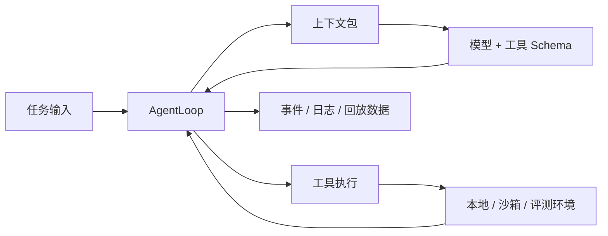

# OpenAgent

> 一个可 Hack 的 Agent Harness 运行时：工具调用、沙箱执行、长上下文与可观测性。


OpenAgent 是一个 Python Agent Core Runtime，用来构建能调用工具、执行代码、运行在沙箱里、管理长上下文并留下可复盘 trace 的 coding agent / task agent。

它关注的不是“再包一层聊天 UI”，而是模型外面的 Harness 工程：**工具、权限、上下文、沙箱、日志、评测和运行时控制**。

<details>
<summary>English version</summary>

OpenAgent is a hackable Python runtime for building tool-using, sandboxed, observable agents.

It focuses on the harness around the model: tool schemas, permission checks, context management, sandbox execution, runtime logs, and benchmark adapters.

## Why OpenAgent

- **Inspectable tool use**: the model receives tool schemas, chooses calls, and OpenAgent executes them through one runtime path.
- **Sandbox-first execution**: the same loop can run against a local workspace, OpenSandbox, Terminal-Bench, or Harbor.
- **Long-task context**: messages, compacted work state, todos, project instructions, file-read cache, and sandbox metadata are tracked as context sources.
- **Traceable runs**: stream events, tool results, context diagnostics, runtime logs, and benchmark output can be written as structured records.
- **Small enough to learn**: the core loop is readable enough to follow from model call to tool execution.

## Quick Start

```bash
python -m venv .venv
source .venv/bin/activate
python -m pip install -e .
PYTHONPATH=src python src/examples/run_query_only.py "Hello OpenAgent"
```

OpenAI-compatible gateway:

```bash
export OPENAI_API_KEY="your-api-key"
export OPENAI_BASE_URL="http://localhost:8080"
export OPENAI_MODEL="gpt-5.5"
export OPENAI_WIRE_API="responses"
```

## Current Scope

OpenAgent includes an agent loop, built-in tools, permission rulesets, context budgeting, structured compaction, file/instruction context, local/OpenSandbox runtimes, Terminal-Bench and Harbor adapters, MCP support, and JSONL-friendly observability.

Still in progress: persistent session recovery, cross-session long-term memory, Anthropic/Gemini/Ollama providers, CLI/Web Console, and making `ContextPackBuilder` the only model-message assembly path.

</details>

## 为什么做 OpenAgent

很多 Agent demo 到“把 tool schema 发给模型，然后执行 tool call”就结束了。但真正做 Agent Harness 时，难点会很快出现：

- 模型到底看到了哪些工具和上下文？
- 工具是在本地执行，还是在远端沙箱执行？
- 长任务里哪些历史应该保留，哪些应该压缩？
- 失败以后如何复盘每一步？
- 怎么接 Terminal-Bench / Harbor 这类评测框架？

OpenAgent 试图把这些问题收敛成一个小而清晰的 runtime。

## 你能得到什么

| 能力 | 说明 |
| --- | --- |
| Agent Loop | 流式输出、多步工具调用、重试、步数限制、patch 事件和停止条件 |
| 工具系统 | 内置 shell、文件、搜索、网页、skill、memory、todo、question 工具 |
| 权限控制 | `FULL`、`READONLY`、`PLAN_ONLY`、`NONE` 四组规则 |
| 上下文工程 | token 预算、结构化压缩、指令文件、文件上下文、todo 状态、context trace |
| 执行环境 | 本地 workspace、OpenSandbox、Terminal-Bench、Harbor |
| 模型接入 | OpenAI-compatible、DashScope；Anthropic/Gemini/Ollama 仍是 stub |
| 可观测性 | stream events、JSONL trace、runtime log、tool events、benchmark logs |
| 评测入口 | 本地 eval/replay，加 Terminal-Bench 和 Harbor adapter |

## 快速开始

安装为 editable 包：

```bash
python -m venv .venv
source .venv/bin/activate
python -m pip install -e .
```

不配置模型 key 也能跑 smoke demo：

```bash
PYTHONPATH=src python src/examples/run_query_only.py "你好，介绍一下 OpenAgent"
```

没有真实模型 key 时，这个 demo 会使用本地 scripted model，方便先验证 OpenAgent 的执行链路。设置 `DASHSCOPE_API_KEY` 后会走 DashScope provider。

## 接入模型网关

OpenAgent 支持 OpenAI-compatible Chat Completions 和 Responses 两种 wire API。

```bash
export OPENAI_API_KEY="your-api-key"
export OPENAI_BASE_URL="http://localhost:8080"
export OPENAI_MODEL="gpt-5.5"
export OPENAI_WIRE_API="responses"
export OPENAI_REASONING_EFFORT="xhigh"
export OPENAI_DISABLE_RESPONSE_STORAGE="true"
export OPENAI_CONTEXT_WINDOW="1000000"
export OPENAI_MAX_OUTPUT="4096"
```

Chat Completions 兼容网关：

```bash
export OPENAI_WIRE_API="chat"
```

## 运行链路



一次任务大致会这样运行：

1. 用户任务进入 `AgentLoop`。
2. OpenAgent 从消息、压缩状态、指令文件、todo、文件缓存和 runtime metadata 里组织模型输入。
3. 模型看到可用 tool schema，决定直接回答或调用工具。
4. OpenAgent 做权限检查，在当前 runtime 中执行工具，并记录结果。
5. Loop 继续推进，直到任务完成、达到限制、需要用户输入或遇到错误。

## 上下文工程

OpenAgent 把上下文当成 runtime 能力，而不是简单拼 prompt。

当前已经追踪这些上下文来源：

- session messages
- structured work-state compaction
- todo state
- `OPENAGENT.md`、`AGENTS.md`、`CLAUDE.md`、`.openagent/rules/*.md` 等项目指令
- 文件读取缓存：path、hash、size、preview、变化状态
- sandbox metadata
- tool output 的展示裁剪和模型上下文裁剪

`ContextPackBuilder` 现在是 trace-first 模式：它先记录“哪些上下文会被纳入、为什么纳入、哪些因为预算被丢弃”，同时不破坏现有模型输入语义。下一步会把它推进成统一的 model-message assembly 管线。

## 沙箱与评测

OpenAgent 的 workspace 工具通过 runtime 抽象来决定执行位置：

| Runtime | 用途 |
| --- | --- |
| `local` | 在本地仓库执行工具 |
| `opensandbox` | 连接远端 OpenSandbox 实例 |
| `terminal_bench` | 通过 `TmuxSession` 跑 Terminal-Bench |
| `harbor` | 通过 Harbor benchmark environment 跑任务 |

Terminal-Bench adapter 示例：

```bash
tb run \
  --dataset terminal-bench-core==head \
  --agent-import-path openagent.integrations.terminal_bench:OpenAgentTerminalBenchAgent \
  --task-id hello-world
```

这个 adapter 实现了官方 `perform_task(instruction, session, logging_dir)` 入口，会把 `bash` 工具路由到 benchmark terminal，并把 OpenAgent events 和 final answer 写进 benchmark logging directory。

## MCP 支持

远程 MCP 工具可以通过 `OPENAGENT_MCP_CONFIG` 注入。

```json
{
  "mcpServers": {
    "demo": {
      "type": "streamableHttp",
      "url": "https://example.com/mcp",
      "headers": {
        "X-Auth-Key": "replace-me"
      },
      "tools": {
        "allow": ["search*", "fetch*"],
        "deny": ["fetchSecret"]
      }
    }
  }
}
```

OpenAgent 会发现远程工具，生成稳定的动态工具名，通过 allow/deny 做过滤，并使用 HTTP 或 SSE transport 调用。

## 示例：自己拉起一个 Loop

```python
import asyncio
from pathlib import Path

from openagent.core.agent.universal import UniversalAgent
from openagent.core.loop.processor import AgentLoop
from openagent.core.permission.manager import PermissionManager
from openagent.core.provider.openai import OpenAIProvider
from openagent.core.session.session import Session
from openagent.core.types import AgentConfig, Model


async def main() -> None:
    model = Model(
        id="gpt-5.5",
        provider_id="openai",
        name="OpenAI Compatible/gpt-5.5",
        context_window=1_000_000,
        max_output=4096,
    )
    language_model = await OpenAIProvider().get_language_model(model)
    agent = UniversalAgent(
        config=AgentConfig(
            name="demo",
            mode="primary",
            model=model,
            tools=["bash", "read", "grep", "ls"],
            permission="READONLY",
            max_steps=20,
        ),
        model=language_model,
    )
    loop = AgentLoop(
        agent=agent,
        session=Session(directory=Path(".")),
        permission_manager=PermissionManager(),
    )

    async for event in loop.run("总结一下这个仓库。"):
        if event["type"] == "text-delta":
            print(event["text"], end="")
        elif event["type"] == "tool-call":
            print(f"\n[tool-call] {event['name']} {event['input']}")


asyncio.run(main())
```

## 项目结构

```text
src/openagent/
├── core/                 # AgentLoop、工具、上下文、会话、Provider、权限
├── integrations/         # Terminal-Bench 和 Harbor adapter
├── adapter/              # 兼容适配层
├── prompts/              # build / plan / explore 默认提示词
└── sdk/                  # SDK 聚合出口

doc/                      # 架构说明和设计文档
docs/ai-engineering/      # 长期任务 backlog 和 progress
src/tests/                # unittest 测试
```

## 测试

核心回归：

```bash
PYTHONPATH=src:src/tests python -m unittest \
  src/tests/test_loop.py \
  src/tests/test_context_pack.py \
  src/tests/test_context_state.py \
  src/tests/test_context_messages.py \
  src/tests/test_file_context.py \
  src/tests/test_terminal_bench_adapter.py \
  src/tests/test_harbor_adapter.py \
  src/tests/test_mcp_config.py
```

全量测试：

```bash
PYTHONPATH=src:src/tests python -m unittest discover -s src/tests -p "test_*.py"
```

最近一次本地验证：196 tests passing。

## 当前缺口

OpenAgent 已经可以作为 core runtime 使用，但产品化能力还在补：

- persistent session storage 尚未接入主执行链路
- `memory_read` / `memory_write` 仍是进程内记忆，不是跨 session 长期记忆
- Anthropic、Gemini、Ollama provider 仍是 stub
- CLI 和 Web Console 需要重建，或拆到独立 package
- `ContextPackBuilder` 当前还是 trace-first，还不是唯一的模型消息构建器

## 文档

- [文档目录](doc/README.md)
- [项目技术文档](doc/openagent-project-doc.md)
- [上下文优化专项](doc/context-optimization-initiative.md)
- [ContextPackBuilder 设计](doc/context-pack-builder-instructions-file-context-design.md)
- [Agent Runtime 记忆机制报告](doc/agent-runtime-memory-mechanism-report.md)
- [OpenSandbox runtime 设计](doc/remote-sandbox-runtime.md)
- [Sandbox session middleware 设计](doc/remote-sandbox-lifecycle.md)
- [可观测性与评测设计](doc/observability-eval-design.md)

## Roadmap

- 将 `ContextPackBuilder` 从 trace-first 推进成统一上下文组装管线
- 接入 persistent session storage 和长期记忆
- 完成 sandbox session 生命周期管理和 skill bootstrap
- 把 Terminal-Bench / Harbor 跑分沉淀成可复现 benchmark report
- 拆分 MCP、sandbox、benchmark 的 optional dependencies
- 增加干净的 CLI 或 Web Console，方便 demo 和产品接入

## License

当前仓库在 `pyproject.toml` 中标记为 `UNLICENSED`。
