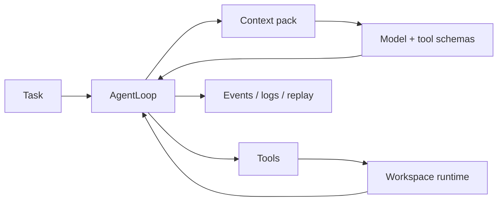

# OpenAgent

> 一个可 Hack 的 Agent Harness Runtime：工具调用、隔离执行、长上下文、可观测性和评测适配。


OpenAgent 是一个 Python Agent Core Runtime。它不尝试做一个完整聊天产品，而是聚焦模型外面的 Harness 工程：**工具 schema、权限、上下文、执行环境、日志、trace、eval 和 benchmark adapter**。

<details>
<summary>English</summary>

OpenAgent is a hackable Python runtime for building tool-using, observable agents. It focuses on the harness around the model: tool schemas, permissions, context management, execution runtimes, logs, traces, evals, and benchmark adapters.

</details>

## Features

| Area | What is included |
| --- | --- |
| Agent loop | Streaming output, multi-step tool calls, retry, stop conditions, patch events |
| Tools | Shell, file, search, web, skill, memory, todo, question, MCP bridge |
| Permissions | `FULL`, `READONLY`, `PLAN_ONLY`, `NONE` rulesets |
| Context | Budgeting, structured compaction, instruction files, file-read state, context traces |
| Execution | Local workspace, optional remote sandbox runtime, Terminal-Bench, Harbor |
| Providers | OpenAI-compatible provider for Chat Completions and Responses-style gateways |
| Operations | Stream events, JSONL-friendly traces, runtime logs, eval/replay |

## Quick Start

```bash
python -m venv .venv
source .venv/bin/activate
python -m pip install -e .
PYTHONPATH=src python src/examples/run_query_only.py "你好，介绍一下 OpenAgent"
```

The smoke demo falls back to a local scripted model when no model key is configured.

OpenAI-compatible gateway:

```bash
export OPENAI_API_KEY="your-api-key"
export OPENAI_BASE_URL="http://localhost:8080"
export OPENAI_MODEL="your-model"
export OPENAI_WIRE_API="responses"
```

## Runtime Shape



The model receives available tool schemas and decides whether to answer or call tools. OpenAgent validates the call, checks permissions, executes it in the current runtime, records events, and continues until the task finishes or needs user input.

## Minimal Usage

```python
import asyncio
from pathlib import Path

from openagent.core.agent.universal import UniversalAgent
from openagent.core.loop.processor import AgentLoop
from openagent.core.permission.manager import PermissionManager
from openagent.core.provider.openai import OpenAIProvider
from openagent.core.session.session import Session
from openagent.core.types import AgentConfig, Model


async def main() -> None:
    model = Model(
        id="your-model",
        provider_id="openai",
        name="OpenAI Compatible",
        context_window=128_000,
        max_output=4096,
    )
    language_model = await OpenAIProvider().get_language_model(model)
    agent = UniversalAgent(
        config=AgentConfig(
            name="demo",
            model=model,
            tools=["bash", "read", "grep", "ls"],
            permission="READONLY",
            max_steps=20,
        ),
        model=language_model,
    )
    loop = AgentLoop(
        agent=agent,
        session=Session(directory=Path(".")),
        permission_manager=PermissionManager(),
    )

    async for event in loop.run("Summarize this repository."):
        if event["type"] == "text-delta":
            print(event["text"], end="")


asyncio.run(main())
```

## Project Layout

```text
src/openagent/
├── core/            # AgentLoop, tools, context, sessions, providers, permissions
├── integrations/    # Terminal-Bench and Harbor adapters
├── adapter/         # Compatibility adapters
├── prompts/         # Default build / plan / explore prompts
└── sdk/             # Aggregated SDK exports

doc/                 # Short public docs
src/tests/           # unittest suite
```

## Tests

```bash
PYTHONPATH=src:src/tests python -m unittest discover -s src/tests -p "test_*.py"
```

Latest local verification: `196 tests OK`.

## Documentation

- [Architecture](doc/architecture.md)
- [Context Engineering](doc/context.md)
- [Operations](doc/operations.md)
- [Roadmap](doc/roadmap.md)

## Current Gaps

- Persistent session storage is not wired into the main loop.
- Memory tools are process-local, not long-term cross-session memory.
- CLI/Web Console are outside the public core.
- `ContextPackBuilder` is trace-first, not yet the only message assembly path.

## License

Current package metadata marks this repository as `UNLICENSED`.
