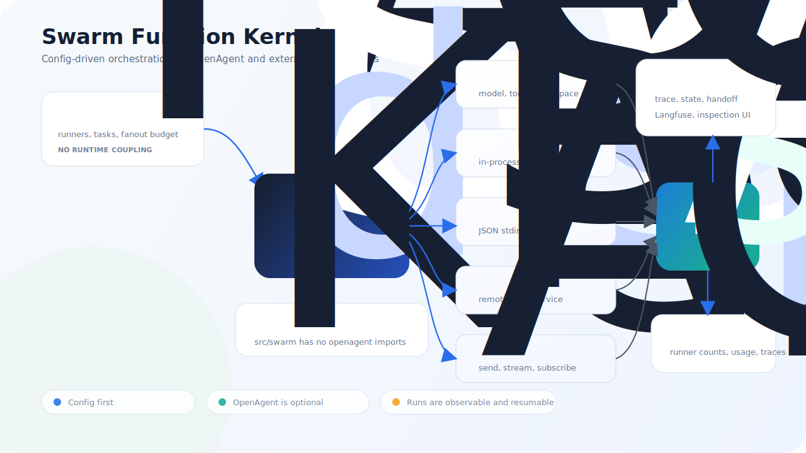
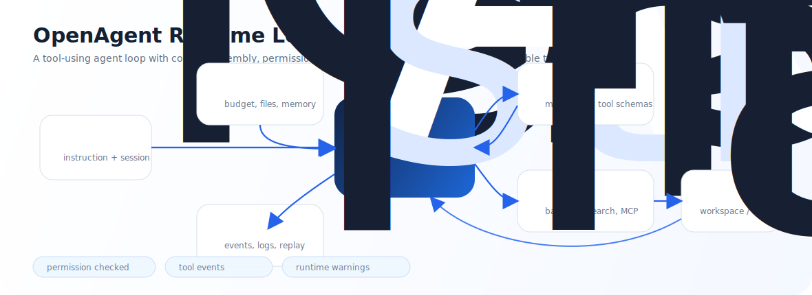

<a id="openagent"></a>

<h1 align="center">OpenAgent</h1>

<p align="center">
  <strong>Agent Harness Runtime with a decoupled Swarm Function Kernel</strong>
</p>

<p align="center">
  
  
  
  
  
</p>

<p align="center">
  <a href="#english">English</a> |
  <a href="#openagent">中文</a> |
  <a href="doc/README.md">User Docs</a>
</p>

OpenAgent 是一个面向 Agent Harness Engineering 的 Python runtime。它关注模型外面的工程系统：工具调用、权限、上下文、执行环境、trace、eval、benchmark、session ledger，以及现在的 **Swarm Function Kernel**。

它不是一个聊天壳，而是一套可以拆开、接入、观察和评测的 Agent 运行时。

<a id="english"></a>

<details>
<summary>English</summary>

OpenAgent is a Python runtime for building observable, tool-using agents. It focuses on the harness around the model: tool schemas, permissions, context management, execution runtimes, traces, evals, benchmark adapters, session ledgers, and a decoupled Swarm Function Kernel for multi-runner orchestration.

</details>

## 为什么是 OpenAgent

现代 Agent 不只是模型外面套一层 prompt。真正可用的 Agent Harness 需要处理一整套工程问题：哪些上下文进入模型，暴露哪些工具，工具在哪里执行，运行过程如何追踪，失败后如何恢复，以及如何用 eval 证明能力真的变好了。

OpenAgent 围绕这些工程问题构建：

- **Agent Loop**：流式模型循环、工具调用、权限、停止条件、patch events。
- **Context Engineering**：上下文预算、压缩、文件上下文、指令状态、context trace。
- **Runtime Isolation**：本地 workspace runtime、可选远端 sandbox、benchmark adapter。
- **Observability**：JSONL trace、session ledger、runtime warning、Langfuse export、eval report。
- **Swarm Function Kernel**：独立的蜂群编排层，可以把一个任务路由到 OpenAgent 或其他外部 agent。

## 蜂群 Function Kernel

蜂群是这个仓库里的 multi-agent / function-mode 编排层。它位于 [`src/swarm/`](src/swarm/)，并且刻意保持 **不依赖 `openagent`**。OpenAgent 通过 [`openagent.integrations.swarm`](src/openagent/integrations/swarm.py) 作为一种 runner 接进去。

这个边界很重要：蜂群不是 OpenAgent 的内部私有逻辑，而是一个更通用的 runner 编排内核。

| Runner kind | 接入对象 | 典型用途 |
| --- | --- | --- |
| `function` | 进程内 Python callable | 本地策略、评分器、确定性 helper |
| `openagent` | OpenAgent `AgentLoop` adapter | 带模型、工具和 workspace 的完整 OpenAgent worker |
| `subprocess` | JSON stdin/stdout CLI agent | 外部脚本、本地 agent CLI、工具型 worker |
| `http` | HTTP JSON endpoint | 简单 JSON 协议背后的远端 agent service |
| `a2a` | Agent2Agent HTTP+JSON endpoint | A2A 兼容 agent，包含 stream / subscribe 路径 |

<p align="center">
  
</p>

### 蜂群现在能做什么

- 把一个任务分发给一个或多个 runner。
- 通过 YAML 描述 runner、task 和 fanout budget。
- 保持 OpenAgent 可插拔，不污染独立的 swarm kernel。
- 持久化 run state、runner results、trace events 和 coordinator receipts。
- 复用已完成 runner 结果，支持长任务 resume。
- 生成 team handoff manifest，区分 pending / reusable runner。
- 在 dispatch 前为 worker 准备隔离 workspace。
- 对隔离 worker 的输出做 merge-back review，再决定是否应用。
- 把 trace lineage 和 receipt metrics 导出到 Langfuse。
- 通过本地 JSON API 和浏览器 UI 查看历史 run。

### 运行完整混合示例

这个示例完全离线运行。它会把一个任务同时路由到四种 runner：OpenAgent、subprocess、HTTP 和 A2A。

```bash
python -m venv .venv
source .venv/bin/activate
python -m pip install -e .

PYTHONPATH=src python src/examples/swarm_mixed_all_runners.py
```

输出结构大致如下：

```json
{
  "status": "completed",
  "runner_kinds": {
    "openagent_researcher": "openagent",
    "subprocess_checker": "subprocess",
    "http_planner": "http",
    "a2a_reviewer": "a2a"
  },
  "receipt": {
    "runner_count": 4,
    "runner_status_counts": {
      "completed": 4
    }
  }
}
```

### 通过 CLI 运行 YAML

config-only CLI 支持不需要进程内 Python 绑定的 runner：

- `subprocess`
- `http`
- `a2a`

```bash
openagent-swarm run swarm.yaml --task compare --run-id compare-demo --pretty
```

持久化 state 和 coordinator receipt：

```bash
openagent-swarm run swarm.yaml \
  --task compare \
  --run-id compare-demo \
  --state-dir .swarm/state \
  --handoff-dir .swarm/handoff \
  --pretty
```

在浏览器里查看持久化 run：

```bash
openagent-swarm inspect \
  --state-dir .swarm/state \
  --handoff-dir .swarm/handoff \
  --host 127.0.0.1 \
  --port 8765
```

然后打开：

```text
http://127.0.0.1:8765
```

同一个服务也会暴露 JSON endpoint：

- `GET /health`
- `GET /runs`
- `GET /runs/{run_id}`
- `GET /runs/{run_id}/state`
- `GET /runs/{run_id}/handoff`
- `GET /runs/{run_id}/receipt`
- `GET /runs/{run_id}/trace`

## 核心 Agent Runtime

OpenAgent 仍然包含完整的单 Agent runtime。模型接收可用工具 schema，决定直接回答或调用工具；OpenAgent 负责校验权限、在当前 runtime 执行工具、记录事件，并持续循环直到任务完成或需要用户输入。

<p align="center">
  
</p>

| Area | What is included |
| --- | --- |
| Agent loop | Streaming output, multi-step tool calls, retry, stop conditions, patch events |
| Tools | Shell, file, search, web, skill, memory, todo, question, MCP bridge |
| Permissions | `FULL`, `READONLY`, `PLAN_ONLY`, `NONE` rulesets |
| Context | Budgeting, structured compaction, instruction files, file-read state, context traces |
| Execution | Local workspace, optional remote sandbox runtime, Terminal-Bench, Harbor |
| Providers | OpenAI-compatible provider for Chat Completions and Responses-style gateways |
| Operations | Stream events, file-backed session ledger, JSONL traces, runtime logs, eval/replay, optional Langfuse export |
| Swarm | Decoupled function/swarm kernel for routing one task to OpenAgent and external runners |

## App Bridge Console

OpenAgent 现在包含一个很薄的本地 App Bridge，用来把现有 `AgentLoop` 接到 UI / CLI / Desktop / IDE 这类客户端。第一版不重做复杂界面，只暴露 session、turn、item event 这条必要链路。

像 Claude Code 一样，OpenAgent 也提供一个直接启动入口。默认使用本地 OpenAI-compatible 网关和 `gpt-5.5`：

```bash
openagent
```

等价于：

```bash
openagent tui --workspace .
```

检查本地模型网关：

```bash
openagent doctor
```

非交互运行一次任务，适合脚本、CI 或快速问答：

```bash
openagent run "summarize this repository"
openagent run --file README.md --format json "review the attached file"
openagent run --continue "continue the last session"
```

管理本地 session、模型元数据和运行统计：

```bash
openagent session list
openagent session export session_abc123 --sanitize
openagent session delete session_abc123
openagent models --format json
openagent stats --format json
```

可选：把本机私有配置放进 `.openagent/openagent.env`，之后直接运行 `openagent` 即可。`.openagent/` 已经被 git 忽略。

```bash
mkdir -p .openagent
cat > .openagent/openagent.env <<'EOF'
OPENAI_API_KEY=your-api-key
OPENAI_BASE_URL=http://localhost:8080
OPENAI_MODEL=gpt-5.5
OPENAI_WIRE_API=responses
OPENAGENT_APP_MAX_STEPS=30
EOF
chmod 600 .openagent/openagent.env
```

启动浏览器控制台：

```bash
openagent web --host 127.0.0.1 --port 8787 --workspace .
```

```bash
python -m pip install -e .

export OPENAI_API_KEY="..."
export OPENAI_BASE_URL="http://localhost:8080/v1"
export OPENAI_MODEL="gpt-5.5"
export OPENAI_WIRE_API="responses"

openagent-app --host 127.0.0.1 --port 8787 --workspace .
```

然后打开：

```text
http://127.0.0.1:8787
```

这层参考 Codex app-server 的 thread / turn / item 思路，但实现上保持 OpenAgent Core 不变。详细说明见 [`doc/app-bridge.md`](doc/app-bridge.md)。

同一套 App Bridge runtime 也驱动终端界面：

```bash
openagent-tui --workspace .
```

TUI 对标 Codex TUI 的能力矩阵见 [`doc/tui.md`](doc/tui.md)。

## 最小 OpenAgent 使用方式

```python
import asyncio
from pathlib import Path

from openagent.core.agent.universal import UniversalAgent
from openagent.core.loop.processor import AgentLoop
from openagent.core.permission.manager import PermissionManager
from openagent.core.provider.openai import OpenAIProvider
from openagent.core.session.session import Session
from openagent.core.types import AgentConfig, Model


async def main() -> None:
    model = Model(
        id="your-model",
        provider_id="openai",
        name="OpenAI Compatible",
        context_window=128_000,
        max_output=4096,
    )
    language_model = await OpenAIProvider().get_language_model(model)
    agent = UniversalAgent(
        config=AgentConfig(
            name="demo",
            model=model,
            tools=["bash", "read", "grep", "ls"],
            permission="READONLY",
            max_steps=20,
        ),
        model=language_model,
    )
    loop = AgentLoop(
        agent=agent,
        session=Session(directory=Path(".")),
        permission_manager=PermissionManager(),
    )

    async for event in loop.run("Summarize this repository."):
        if event["type"] == "text-delta":
            print(event["text"], end="")


asyncio.run(main())
```

OpenAI-compatible gateway：

```bash
export OPENAI_API_KEY="your-api-key"
export OPENAI_BASE_URL="http://localhost:8080/v1"
export OPENAI_MODEL="your-model"
export OPENAI_WIRE_API="responses"
```

## 项目结构

```text
src/openagent/
├── core/            # AgentLoop, tools, context, sessions, providers, permissions
├── integrations/    # Terminal-Bench, Harbor, and Swarm adapters
├── adapter/         # Compatibility adapters
├── prompts/         # Default build / plan / explore prompts
└── sdk/             # Aggregated SDK exports

src/swarm/           # Agent-agnostic function/swarm kernel
src/examples/        # Runnable examples, including mixed swarm examples

.openagent/skills/   # Public skill snapshots
doc/                 # Short public docs
src/tests/           # unittest suite
```

## 测试

运行完整测试：

```bash
PYTHONPATH=src:src/tests python -m unittest discover -s src/tests -p "test_*.py"
```

只运行 swarm 测试：

```bash
PYTHONPATH=src:src/tests python -m unittest discover -s src/tests -p "test_swarm*.py"
```

## 文档

- [Architecture](doc/architecture.md)
- [Context Engineering](doc/context.md)
- [Operations](doc/operations.md)
- [Swarm Function Kernel](doc/swarm.md)
- [Roadmap](doc/roadmap.md)

## 当前边界

- OpenAgent session crash recovery、compaction-boundary restore、database-backed session history 仍在 roadmap 中。
- Memory tools 目前是进程内能力，还不是跨 session 的长期记忆。
- `ContextPackBuilder` 已经 trace-first，但还不是唯一 message assembly path。
- Tool execution 已有 runtime scheduling metadata 和 batch planner，但 `AgentLoop` 仍是串行执行工具。
- Swarm 已经可用，但非 demo 场景下的 OpenAgent binding ergonomics 还需要继续打磨。

## License

Current package metadata marks this repository as `UNLICENSED`.
