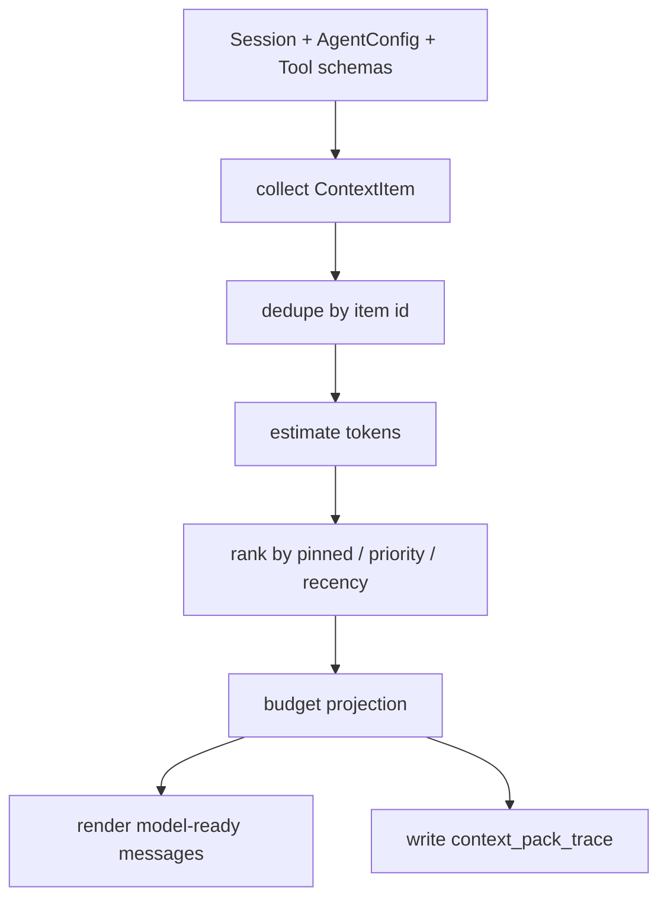

# ContextPackBuilder、InstructionContextLoader 与 FileContextState 设计

本文档把 OpenAgent 上下文工程加固路线中的前两个任务拆成可执行工程计划：

1. `ContextPackBuilder MVP`
2. `InstructionContextLoader + FileContextState`

目标不是一次性复刻 Agent Runtime，而是在 OpenAgent 当前结构上完成一个可测试、可演进、可review表达的上下文工程基础层。

## 1. 背景

OpenAgent 当前已经具备：

- `Session.messages`
- `Session.todos`
- `Session.metadata`
- runtime datetime synthetic message
- context budget
- old tool output prune
- structured work state compaction
- full / brief / minimal projection
- tool result preview 与 output path
- skill registry 与 `skill` 工具
- MCP bridge
- sandbox execution metadata
- observability / runtime logging

当前问题是：这些能力仍然散落在不同模块里。模型调用前“到底有哪些上下文来源、哪些被保留、哪些被裁剪、为什么裁剪”，还没有统一入口。

因此第一阶段应该补：

```text
Context source
  -> ContextItem
  -> ContextPackBuilder
  -> budget projection
  -> context_pack_trace
  -> model-ready messages
```

第二阶段补：

```text
Instruction files + File read/write state
  -> stable context / file context
  -> ContextItem
  -> ContextPackBuilder
```

## 2. 非目标

本阶段不做：

- 大型 RAG。
- LSP 索引。
- 向量数据库。
- full ToolSearch/tool_reference 协议。
- session JSONL graph resume。
- subagent context merge。
- 自动后台 session memory。

这些是后续阶段，不应该混入第一个月的 MVP。

## 3. 设计目标

### 3.1 ContextPackBuilder MVP

目标：

- 把 OpenAgent 当前上下文来源统一成 `ContextItem`。
- 在不破坏现有 `build_messages_for_model()` 行为的前提下，增加可诊断的 pack pipeline。
- 每次模型调用前，能解释：
  - 有哪些 context item。
  - 每个 item 类型是什么。
  - 是否进入模型。
  - token 估算是多少。
  - 被丢弃的原因是什么。

首批来源：

- runtime context
- structured work state
- todos
- recent messages
- tool result previews
- sandbox execution metadata

### 3.2 InstructionContextLoader

目标：

- 把项目规则、用户规则和团队约定作为稳定上下文加载。
- 支持 Agent Runtime / opencode 兼容入口。
- 避免每轮用户重复说明项目约定。

首批支持文件：

- `OPENAGENT.md`
- `AGENTS.md`
- `CLAUDE.md`
- `.openagent/instructions.md`
- `.openagent/rules/*.md`

### 3.3 FileContextState

目标：

- 把“读前写保护”升级成“模型已读文件状态”。
- 记录模型看过哪些文件、什么时候看过、是否变化。
- 为后续 changed file context、post-compact restore 打基础。

首批字段：

- path
- absolute_path
- mtime_ns
- size_bytes
- content_hash
- read_at_ms
- preview
- source_tool

## 4. 核心数据结构

### 4.1 ContextItem

```python
@dataclass(frozen=True, slots=True)
class ContextItem:
    id: str
    kind: Literal[
        "runtime",
        "work_state",
        "todo",
        "message",
        "tool_result",
        "instruction",
        "file",
        "skill",
        "mcp",
        "sandbox",
        "diagnostic",
    ]
    source: str
    content: str
    priority: int
    token_estimate: int = 0
    pinned: bool = False
    stable_prefix: bool = False
    ttl_turns: int | None = None
    metadata: dict[str, Any] = field(default_factory=dict)
```

语义：

- `kind`：上下文类型。
- `source`：来源模块，例如 `session.messages`、`instructions.CLAUDE.md`。
- `priority`：越高越优先保留。
- `pinned`：预算紧张时也尽量保留。
- `stable_prefix`：可作为稳定前缀候选，未来用于 prefix cache。
- `ttl_turns`：后续 attachment bus 使用，MVP 可先保留字段。

### 4.2 ContextPack

```python
@dataclass(frozen=True, slots=True)
class ContextPack:
    messages: list[ChatMessage]
    items: list[ContextItem]
    trace: list[ContextPackTraceEntry]
    estimated_input_tokens: int
```

### 4.3 ContextPackTraceEntry

```python
@dataclass(frozen=True, slots=True)
class ContextPackTraceEntry:
    item_id: str
    kind: str
    source: str
    priority: int
    pinned: bool
    stable_prefix: bool
    token_estimate: int
    included: bool
    drop_reason: str | None
```

## 5. ContextPackBuilder 流程



MVP 流程：

1. 从现有 `build_messages_for_model()` 得到基础 messages。
2. 将 synthetic work state、runtime context、tool result preview 等抽象成 `ContextItem`。
3. 首版不强行改动所有渲染行为，先保证 trace 可解释。
4. 后续逐步让 builder 接管 message projection。

## 6. 上下文优先级建议

| kind | 默认 priority | pinned | stable_prefix | 说明 |
| --- | ---: | --- | --- | --- |
| instruction | 100 | true | true | 项目/用户规则 |
| work_state | 95 | true | false | compact 后恢复核心 |
| runtime | 90 | true | false | 当前日期、执行模式 |
| sandbox | 85 | true | true | session-sandbox 绑定 |
| todo | 80 | false | false | 当前工作计划 |
| file | 70 | false | false | 已读/变化文件 |
| skill | 65 | false | true | 已加载 skill |
| mcp | 60 | false | true | MCP 工具/指令摘要 |
| tool_result | 50 | false | false | 工具结果 preview |
| message | 40 | false | false | 普通历史消息 |
| diagnostic | 20 | false | false | 调试信息 |

## 7. InstructionContextLoader 设计

### 7.1 搜索顺序

从当前 `session.directory` 开始，向上查找：

1. `OPENAGENT.md`
2. `AGENTS.md`
3. `CLAUDE.md`
4. `.openagent/instructions.md`
5. `.openagent/rules/*.md`

再读取用户级：

1. `~/.openagent/OPENAGENT.md`
2. `~/.openagent/instructions.md`
3. `~/.openagent/rules/*.md`

### 7.2 限制

默认限制：

- 单文件最大 16KB。
- 总 instruction context 最大 48KB。
- 跳过二进制。
- path 必须落在 workspace ancestor 或用户配置目录内。
- 重复文件只注入一次。

### 7.3 输出

输出 `InstructionContext`：

```python
@dataclass(frozen=True, slots=True)
class InstructionContext:
    items: list[InstructionItem]
    total_bytes: int
    truncated: bool
    issues: list[str]
```

每个 `InstructionItem` 可转为 `ContextItem(kind="instruction")`。

实现说明：

- `InstructionContextLoader` 已落在 `src/openagent/core/instructions.py`。
- 默认单文件限制 16KB，总量限制 48KB。
- workspace 查找顺序为当前目录到父目录，支持 `OPENAGENT.md`、`AGENTS.md`、`CLAUDE.md`、`.openagent/instructions.md`、`.openagent/rules/*.md`。
- user 查找目录为 `~/.openagent`，支持 `OPENAGENT.md`、`instructions.md`、`rules/*.md`。
- `AgentLoop` 已把 instruction items 接入 `context_pack_trace`，但仍保持 trace-only，不改变实际模型输入。

## 8. FileContextState 设计

### 8.1 当前 OpenAgent 状态

`Session.remember_file_read()` 当前只记录 `_read_files`，主要用于 read-before-write safety。

这个能力需要保留，但不够支持长上下文：

- 不知道文件什么时候读过。
- 不知道读的时候文件内容 hash。
- 不知道当前文件是否变化。
- 不知道 compact 后该恢复哪些文件。

### 8.2 新状态

建议写入：

```text
Session.metadata["file_context_state"]
```

结构：

```json
{
  "schema_version": 1,
  "records": {
    "/abs/path/src/app.py": {
      "path": "src/app.py",
      "absolute_path": "/abs/path/src/app.py",
      "mtime_ns": 1760000000000,
      "size_bytes": 1234,
      "content_hash": "sha256:...",
      "read_at_ms": 1760000000000,
      "source_tool": "read",
      "preview": "..."
    }
  }
}
```

实现说明：

- `FileContextState` 已落在 `src/openagent/core/file_context.py`。
- `record_file_read()` 可把读取记录写入 `Session.metadata["file_context_state"]`。
- `FileContextState.changed_records()` 可判断已读文件是否 missing、size changed 或 hash changed。
- `FileContextState.to_context_items()` 可输出 `ContextItem(kind="file")`，供后续 ContextPackBuilder 接入。
- read/write/edit 工具接入留给 CE-009，避免核心状态模型和工具行为变更混在一个提交。

### 8.3 工具接入

首批接入：

- `read` 成功后记录 file context。
- `write` / `edit` 成功后更新或标记 changed。
- `ls` / `grep` / `glob` 不记录完整文件 context，只记录 tool result preview。

### 8.4 后续扩展

- changed file attachment。
- post-compact recent file restore。
- 文件 hash 去重。
- 文件片段级 read range。
- 与 instruction/rules 的 nested loading 联动。

## 9. 任务拆解

### 任务 1：ContextPackBuilder MVP

#### 1.1 设计文档

产出：

- `doc/context-pack-builder-instructions-file-context-design.md`
- 长期任务追踪文件

验收：

- 设计覆盖数据结构、流程、优先级、验收标准。
- 明确不做项。

#### 1.2 新增 context pack 模块

产出：

- `src/openagent/core/context_pack.py`
- `src/tests/test_context_pack.py`

验收：

- `ContextItem`、`ContextPack`、`ContextPackBuilder` 可导入。
- 至少支持 runtime、work_state、todo、message、tool_result、sandbox 6 类来源。
- `ContextPackBuilder.build()` 返回 messages + trace。
- 单测 >= 12 个。

#### 1.3 接入 AgentLoop

产出：

- `AgentLoop` 在每次模型调用前使用 builder 生成或记录 context pack trace。

验收：

- 不改变现有模型输入语义。
- `Session.metadata["context_pack_trace"]` 每次模型调用更新。
- 现有 context budget 测试通过。

实现说明：

- 当前接入点在 budget fallback、follow-up 注入、runtime context 注入、final-step 处理之后。
- 写入 `Session.metadata["last_context_pack"]` 和最近 20 次 `Session.metadata["context_pack_trace"]`。
- 额外记录 `context.pack_built` observability event。
- sandbox context 只记录 `mode`、`sandbox_id`、`remote_workdir`，不记录 connection token。

#### 1.4 文档和示例

产出：

- 更新 `doc/context-optimization-initiative.md`
- 更新 `doc/README.md`

验收：

- 文档说明 `ContextPackBuilder` 如何和 structured work state 连接。

### 任务 2：InstructionContextLoader + FileContextState

#### 2.1 InstructionContextLoader

产出：

- `src/openagent/core/instructions.py`
- `src/tests/test_instructions.py`

验收：

- 支持 workspace/user instruction files。
- 支持 `.openagent/rules/*.md`。
- 有单文件/总量限制。
- 输出可转为 `ContextItem(kind="instruction")`。
- 单测 >= 8 个。

#### 2.2 FileContextState

产出：

- `src/openagent/core/file_context.py`
- `src/tests/test_file_context.py`

验收：

- 成功记录 read 文件状态。
- 能判断文件是否变化。
- 能生成 `ContextItem(kind="file")`。
- 单测 >= 8 个。

#### 2.3 工具接入

产出：

- `read` / `write` / `edit` 工具更新 file context state。

验收：

- 读文件后 `Session.metadata["file_context_state"]` 有记录。
- 写/改文件后能标记状态变化。
- read-before-write safety 不回退。

#### 2.4 文档和测试

产出：

- 更新项目技术文档。
- 增加 long-context eval case。

验收：

- 相关单测通过。
- 至少 1 个 eval case 验证 instruction context 被保留。
- 至少 1 个 eval case 验证 file context 可恢复。

## 10. 提交与推送策略

每一步独立提交并推送：

1. `docs: plan context engineering hardening`
2. `feat: add context pack builder`
3. `test: cover context pack builder`
4. `feat: add instruction context loader`
5. `feat: add file context state`
6. `docs: update context engineering documentation`

每个提交必须满足：

- 只 stage 当前步骤相关文件。
- 跑最近相关测试。
- 在 `docs/ai-engineering/progress.md` 记录结果。
- 推送当前分支到 GitHub。

当前分支建议：

```text
codex/context-engineering-hardening
```

## 11. 风险

| 风险 | 处理 |
| --- | --- |
| 当前工作区已有未提交改动 | 每次只 stage 明确文件，避免混入无关变更 |
| 接入 AgentLoop 影响现有预算逻辑 | 先只做 trace-only 接入，再逐步接管 projection |
| instruction 文件过长 | 默认单文件/总量限制 |
| file context 泄露敏感内容 | 默认 preview 截断，后续接入脱敏 |
| metadata 膨胀 | file context 设置数量和字节上限 |
| 测试依赖不稳定 | 先用 core unit test，不依赖真实模型 |
