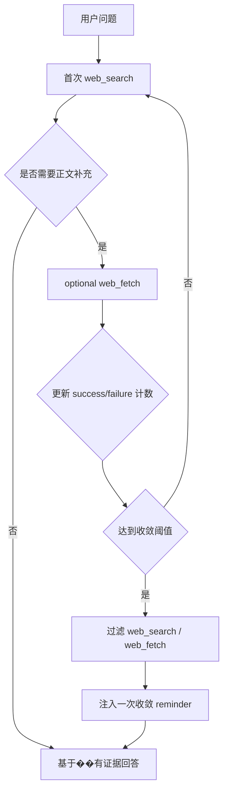

# OpenAgent 网页研究收敛设计

## 目标

这份设计文档描述 OpenAgent core 如何在研究型问题中减少 `web_search -> web_fetch -> web_search` 的摆动，让一次搜索返回更高密度的可回答上下文，并在 web research 失控前强制收敛。

本方案的目标是：

- 提升单次 `web_search` 的信息密度，减少对后续 `web_fetch` 的依赖
- 降低 `web_fetch` 失败后再次触发 `web_search` 的概率
- 为单个 user turn 引入轻量收敛机制，限制 web research 工具链在 loop 中无界摆动

本方案是最小可行整改，不重构成 provider-native browsing 系统，也不改变现有 HTTP API、tool schema 或 provider payload。

---

## 问题背景

### 当前 OpenAgent 的三层成因

当前 OpenAgent 在研究型问题上更容易出现重复 `web_search`，主要有三层原因：

- 默认 system prompt 会主动引导模型在 research、latest、unknown-fact 问题上优先使用 `web_search`
- `web_search` 与 `web_fetch` 是分离工具，search 后模型经常仍需要 fetch 正文补证据
- loop 在工具失败后会追加 follow-up，容易把模型再次推回 web research，而不是基于已有证据收敛回答

### 当前死循环保护的不足

现有 doom loop 机制只能拦截“连续 3 次完全相同工具名和输入”的调用。它可以阻止：

- 连续 3 次相同 `web_search(query=A)`
- 连续 3 次相同 `web_fetch(url=B)`

但无法阻止如下交替摆动：

- `web_search(query=A)` -> `web_fetch(url=B)` -> `web_search(query=C)`
- `web_search(query=A)` -> `web_fetch(url=B)` -> `web_fetch(url=D)` -> `web_search(query=E)`

因此，现有 doom loop 无法解决研究型工具链的“扩散式重试”问题。

### 与其他 Agent Runtime 的行为差异

与一些成熟 agent runtime 相比，OpenAgent 在 web research 上曾经有三个明显差异：

- 一次 `web_search` 返回的正文上下文密度偏低
- loop 对 research failure 的收敛控制不足，失败后容易继续扩大搜索范围
- 搜索、打开页面、查找页面内容分散在不同工具能力里

本方案不复制特定产品的 provider-native browsing，而是在 OpenAgent 当前架构内做两个通用改进：提升单次 search 信息密度，并增加 turn 级收敛控制。

---

## 总体设计

### 1. AgentLoop 内增加 turn 级 web research 收敛状态

在单个 user turn 内维护 web research 的运行时状态，跟踪：

- 成功的 `web_search` 次数
- 失败的 `web_fetch` 次数
- 当前 turn 是否已经进入收敛模式

这套状态不落盘、不暴露到外部协议，只在当前 loop 生命周期内生效。

### 2. `web_search` 默认返回更高信息密度

在未显式传 `context_max_characters` 时，`web_search` 默认使用 `10000`，从 Exa 返回更高密度的上下文文本，尽量让模型在一次 search 后就拿到可回答材料。

现有默认行为保持不变：

- `type=auto`
- `livecrawl=fallback`
- `numResults=8`

### 3. `web_fetch` 连续失败后停止继续扩大 web research

当 `web_fetch` 在当前 user turn 内连续失败到阈值后，loop 不再继续暴露 `web_fetch`，并在必要时同时停止继续暴露 `web_search`，要求模型基于已经收集到的证据给出 bounded answer，而不是继续扩大 research 面。

### 流程示意

---

## 关键行为设计

### 计数与收敛规则

在单个 user turn 内执行以下累计规则：

- `web_search` 成功一次，就累计一次 evidence
- `web_fetch` 失败一次，就累计一次 fetch-failure
- 首次进入收敛模式后，标记本 turn 已收敛，避免重复提醒

阈值固定为：

- `successful_web_search_count >= 3`
- 或 `failed_web_fetch_count >= 2` 且至少已有 1 次成功 `web_search`

### 工具暴露收敛规则

达到阈值后，不再继续暴露对应 web 工具：

- 达到 search 阈值后，下一 step 不再暴露 `web_search`
- 达到 fetch 失败阈值后，下一 step 同时不再暴露 `web_fetch`
- 如果 fetch 失败阈值成立且已有 search evidence，则默认也不再继续暴露 `web_search`

这套规则只影响当前 user turn 的后续 step，不影响下一次新用户输入。

### synthetic reminder 合成提醒注入规则

首次进入收敛模式时，loop 追加一次 synthetic follow-up，要求模型：

- 不要继续扩大 web research 范围
- 不要因为个别页面抓取失败而继续无界搜索
- 基于已有证据给出 bounded answer
- 明确指出仍然缺失的信息或不确定性

该 reminder 只注入一次，后续 step 不重复追加。

### follow-up 追问文案策略调整

对 `web_fetch` 失败，后续引导不再鼓励：

- “try a different source”
- “try a different method”

而改为：

- 优先基于已有 search evidence 收敛回答
- 如果关键信息仍不足，再使用剩余允许的 web 工具
- 显式标出剩余证据缺口

非 web 工具失败仍保留现有 generic failure follow-up 语义。

### `web_search` 默认请求策略

`web_search` 在调用 Exa MCP 时采用以下默认策略：

- 未显式传 `context_max_characters` 时，默认使用 `10000`
- 保持 `type=auto`
- 保持 `livecrawl=fallback`
- 保持 `numResults=8`

这样做的目标是让一次 search 更接近“重 search”，减少 search 后必须继续 fetch 多个页面的概率。

---

## 接口与兼容性

### 保持不变

以下外部接口和契约保持不变：

- HTTP API
- tool schema
- session metadata
- provider payload

本次行为变化只体现在 core 的运行时策略。

### 兼容性约束

- doom loop 机制继续保留，仍然只负责 exact-same-call 的保护语义
- 非 web 工具链行为不变
- local / opensandbox 模式都继承同一套收敛逻辑
- 当前不引入新的 provider-native browsing 能力，也不改变现有 `web_search` / `web_fetch` 工具名

---

## 测试方案

需要覆盖以下场景：

- `web_search` 成功 3 次后，下一 step 不再暴露 `web_search`
- 成功 1 次 `web_search` 且失败 2 次 `web_fetch` 后，下一 step 不再暴露 `web_search` 和 `web_fetch`
- synthetic reminder 只注入一次，不会在后续 step 重复追加
- 未显式传 `context_max_characters` 时，`web_search` 请求默认带 `10000`
- 非 web 工具失败 follow-up 不回归
- doom loop 检测仍保留 exact-same-call 语义，不被新的收敛逻辑替代

---

## 假设

- v1 目标是先改善收敛性，不追求复刻 opencode 的 provider-native browsing
- 阈值先写死在 core，不先做配置化
- 优先接受“更保守但更稳定”的 research 行为
- 当前文档面向 core 设计，不展开 web 或 HTTP runtime 的特殊处理
